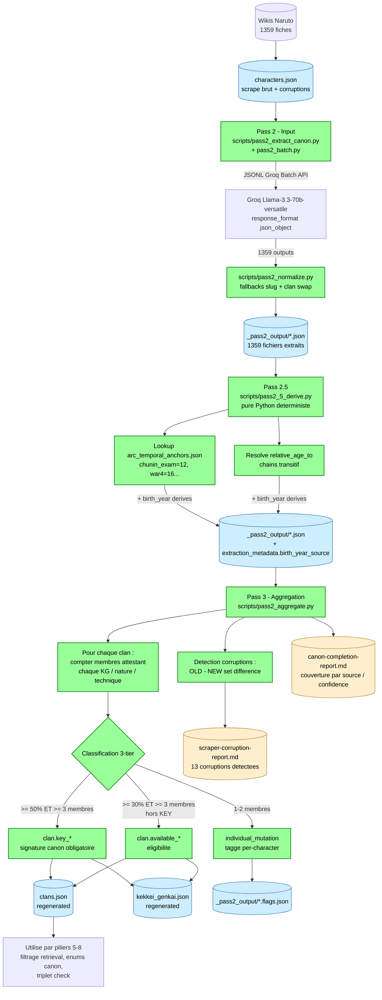

# Canon completion : Pass 2 -> Pass 2.5 -> Pass 3

Vue du sous-projet de completion canon ferme le 2026-05-04. Pipeline
en 3 passes, $2.30 brules au total, 1359 personnages couverts a 100%.

Stats finales :
- 1359 / 1359 personnages extraits (100%)
- 14 / 52 clans avec attestations canoniques (4 key, 12 available)
- 232 mutations individuelles taggees
- 13 corruptions scraper detectees
- $2.30 brules sur Groq (50% off Batch API), wall time ~6h

Voir `research/canon-cleanup-handoff.md` pour le detail.
