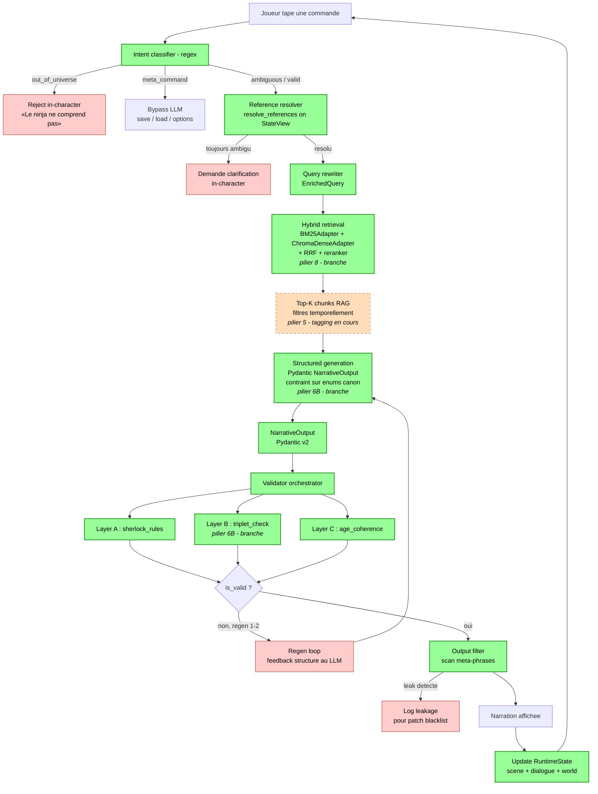

# Pipeline overview

Vue end-to-end du pipeline anti-hallucination de Shinobi no Sho.
Un tour de jeu suit ce flow, du moment ou le joueur tape sa commande
jusqu'a la narration affichee a l'ecran.

Legende :
- vert plein : livre, teste (couches A+B+C, structured gen, hybrid retrieval branche)
- orange pointille : tagging temporel chunks RAG en cours (Phase 5)
- rouge clair : chemin de rejet ou de feedback

Le pipeline est concu pour echouer rapidement et fournir des messages
in-character au joueur quand un rejet a lieu, sans casser la 4e mur.
