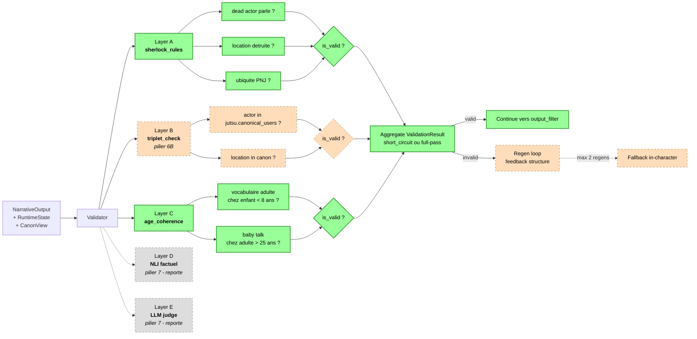

# Validator layers

Structure du Validator central (pilier 3) avec ses 5 couches A->E.
Aujourd'hui les couches A et C sont livrees, B arrive avec le pilier 6B
ce soir, D et E sont reportees au pilier 7 et au-dela.

Mode d'execution :
- `short_circuit=True` (default) : s'arrete au premier reject, latence
  optimisee.
- `short_circuit=False` : execute toutes les couches, utile pour le
  logging et le feedback regen complet.

Latences mesurees (validator MVP, sans LLM) :
- Layer A : < 1 ms par output
- Layer C : < 5 ms par output (regex sur prose)
- Layer B (a venir) : O(jutsus_extraits * canonical_users), < 1 ms
  attendu sur les enums charges en memoire
